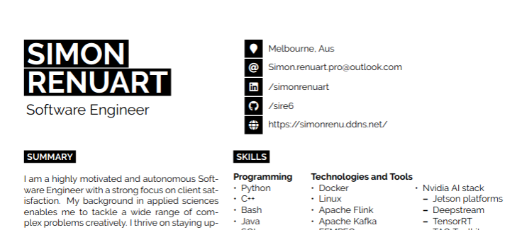

<p align="center">
  
  
  
</p>

<p align="center">
  
</p>

This repo contains my LaTeX CV, built automatically with Nix and GitHub Actions. Every change updates the PDF at a public, stable URL.
## 🚀 How it works

On every push or pull request to <strong>main</strong>:

1. A <span style="color:#6e40c9">GitHub Actions</span> workflow uses <strong>Nix</strong> to create a reproducible LaTeX environment and compile <code>resume.tex</code>.
2. The resulting PDF is published to GitHub Pages at a fixed, public URL—always up-to-date, no manual steps required.


## 📁 Repository structure

- <code>resume.tex</code>: Main LaTeX source
- <code>developercv.cls</code>: Custom class file
- <code>build/</code>: Output directory for generated files (PDF, aux, log, etc.)
- <code>.github/workflows/latex-pdf.yml</code>: GitHub Actions workflow for CI/CD
- <code>shell.nix</code>: Nix environment for local builds
- <code>LICENSE</code>: MIT License


## 🖥️ Local usage

To build the CV locally with Nix:

```bash
nix-shell
build-resume
```

This generates <code>build/resume.pdf</code>. Open it with your preferred PDF viewer.

<details>
<summary>What does <code>build-resume</code> do?</summary>

The <code>build-resume</code> alias runs <code>pdflatex</code> twice in the correct environment to ensure all references are resolved. You must be inside the Nix shell for this alias to work.
</details>


## 🌐 Public PDF URL

The latest version of the CV PDF is always available at:

👉 <a href="https://sire6.github.io/resume/resume.pdf" target="_blank"><code>https://sire6.github.io/resume/resume.pdf</code></a>


## 👥 Authors & credits

- Original template: <strong>Jan Vorisek</strong> (based on a template by Jan Küster)
- Modifications and adaptation: Simon Renuart

<sub>Thanks to Jan Vorisek for creating and sharing the original template under the MIT license. See LICENSE for details.</sub>

---

